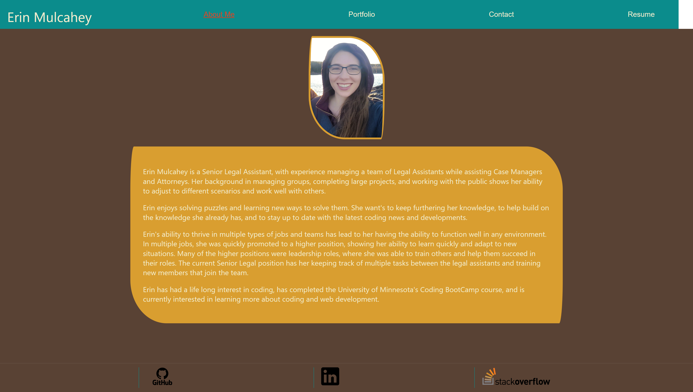
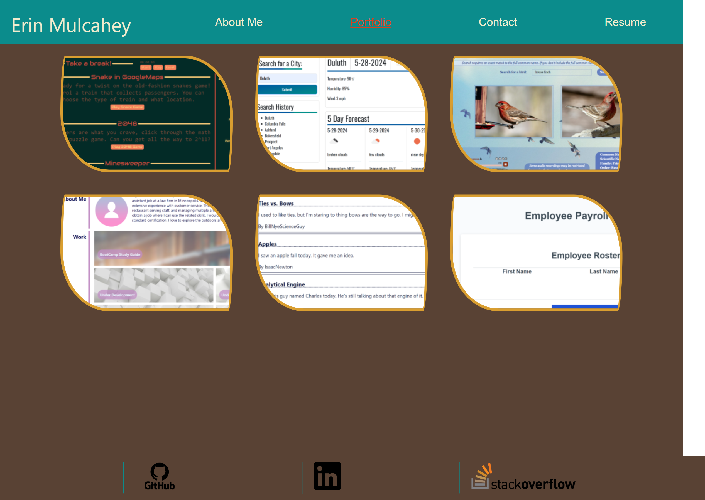
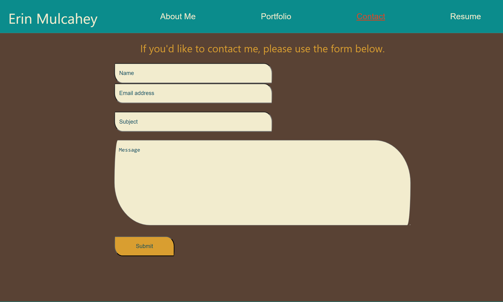
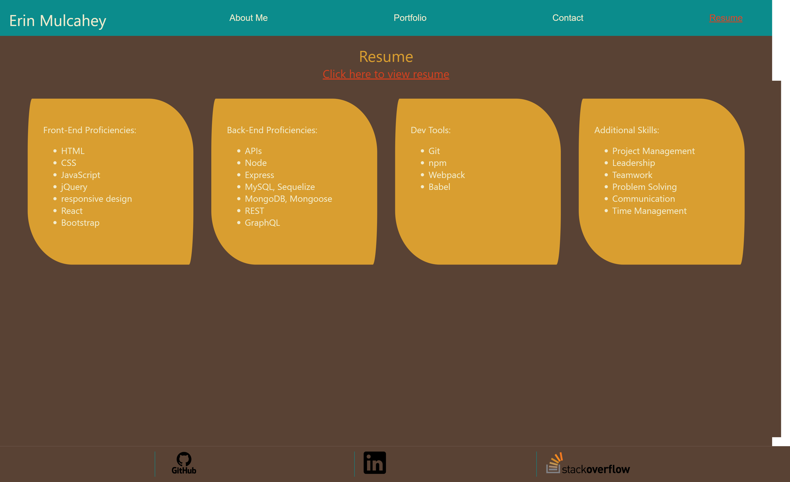

# React_Portfolio_Erin_Mulcahey

## Description

My motivation for creating this application was to create a place where I can share my projects with potential jobs and other developers. I created this portfolio using React skills to help learn the latest technologies. Creating this application solves the problem of not having multiple projects all in one place. This site showcases how I used react to create an application that fulfills this need. I learned how to use React and how to push my application to Netlify to make it a live.

## Installation

If a user wants to use the website for it's intended purpose, they just need to go to the deployed website's link.

To use this program, the user will need to: -Clone this repository. And, open the repository from the installed folder. -Access the integrated terminal and install npm to use the repository. -type 'npm start' into the integrated terminal. -That will then Runs the app in the development mode. -the site can be opened in a web browser at localhost:3000.

## Usage

The user can go to the deployed website and see all it's functionality. There are 4 tabs at the top to choose from: About Me, Portfolio, Contact, Resume. On the about Me page, the user can read text that explains infomration about the creator of the application. The portfolio will show the user multiple works from the creator and give links to each of the different works. the contact page will give the user a way to contac the creator by filling out a contact form. The resume page has a list of a lot of skills that the creator has. The resume page also has a link to the user's resume.

Deployed Link: https://lovely-moonbeam-0307e3.netlify.appLinks to an external site.

## Credits

N/A

## License

Please refer to the LICENSE in the repo.
